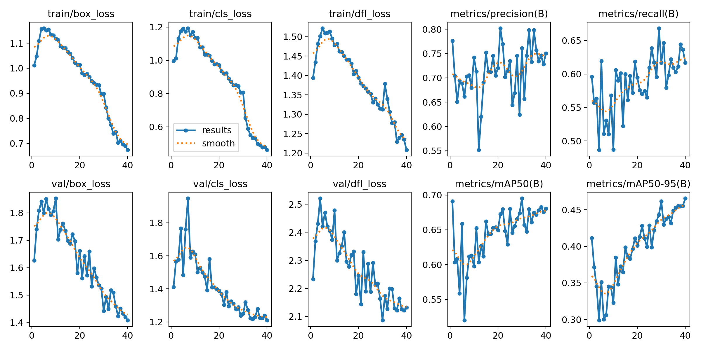

# Project Overview
Welcome to the Lettuce Disease Detection repository! The Lettuce Disease Detection project is a part of our indoor farming project, aims to provide an automated solution for disease identification, helping in timely intervention and treatment.This project focuses on training the YOLOv11 model to accurately classify diseases affecting lettuce plants. The model is trained to detect and classify seven conditions: 'Bacterial,' 'Downy Mildew on Lettuce,' 'Powdery Mildew on Lettuce,' 'Septoria Blight on Lettuce,' 'Viral,' 'Wilt and Leaf Blight on Lettuce,' and 'Healthy.' Early detection and classification are essential for preventing disease spread and ensuring healthy crop yields."

## Status
⚠️ **The code and dataset provided are for demonstration purposes only.**
We are in the final stages of an ongoing funded project by the Research Center of Shahjalal University of Science and Technology. The code and dataset will be uploaded soon after the project submission.

## Getting Started
To run the training script, follow these steps:

1. **Clone the Repository**: Start by cloning this repository to your local machine.

    ```bash
    git clone https://github.com/MdSyamul/lettuce-disease-detection.git
    ```
    
2. **Set Up a Virtual Environment**: It’s recommended to use Python 3.12.3 for compatibility.

    ```bash
    python3 -m venv lettuce_env
    source lettuce_env/bin/activate  # On Windows use: lettuce_env\Scripts\activate
    ```

3. **Install PyTorch**: Ensure you install a version of PyTorch compatible with your CUDA version. Follow the instructions at [PyTorch's official installation guide](https://pytorch.org/get-started/locally/) to install the correct version.

4. **Install Ultralytics**: This package includes necessary tools for training.

    ```bash
    pip install ultralytics
    ```

5. **Run the Training Script**: Open the `train.ipynb` notebook in Jupyter and run the cells to begin training.

    ```bash
    jupyter notebook train.ipynb
    ```


## Results
The training process generates logs, visualizations, and model checkpoints, which can be used to assess the model's performance and make further improvements.

### Training Performance
The following plots show the training and validation loss over 120 epochs, as well as the precision, recall, and mAP (mean average precision) metrics.



- **Box Loss**: The reduction in the bounding box loss over time indicates that the model is learning to detect lettuce diseases more accurately.
- **Classification Loss**: The decreasing classification loss shows that the model is improving in identifying the correct class for each detection.
- **DFL Loss**: This tracks the distribution focal loss, and the decline shows better focus on relevant regions.
- **Precision & Recall**: These metrics show how well the model identifies true positive cases versus false positives and negatives, improving over time.
- **mAP**: The increasing mAP values, both for IoU thresholds of 50% and 50-95%, demonstrate the model's performance across various intersection over union thresholds.

### Inference Examples
Below are sample predictions made by the model on lettuce disease images. The bounding boxes highlight the areas identified as disease-affected.


These results demonstrate the model's ability to detect and classify multiple disease instances within a single image, aiding in early detection for agricultural applications.

By reviewing these results, improvements in both accuracy and precision can be identified for future iterations.


## Contributing
Contributions to the Lettuce Disease Detection project are welcome. If you have any suggestions or improvements, please create a pull request or open an issue.

## Funding and Acknowledgments
This project is funded by the **Research Center of Shahjalal University of Science and Technology**. We express our sincere gratitude for their support and resources, which have been instrumental in advancing this research.

## Contact
For questions, collaborations, or further information, please contact:

- **Project Lead**: Md. Syamul Bashar
- **Email**: md.syamul-mee@sust.edu
- **Institution**: Department of Mechanical Engineering, Shahjalal University of Science and Technology

## License
This project will be licensed under the [MIT License](LICENSE) upon release.

---

Stay tuned for updates! We are excited to share our work with the community and contribute to advancements in agricultural technology.
